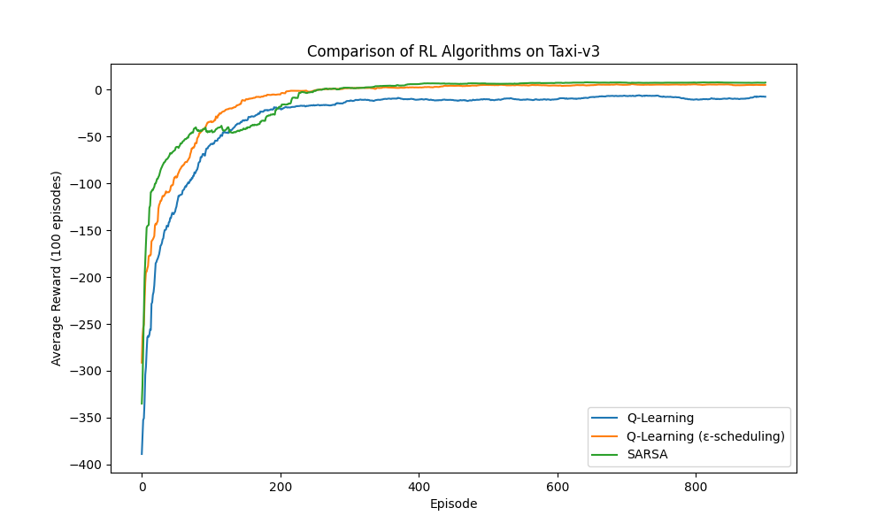

# Rapport du TP3 de Reinforcement Learning sur le problème "Taxi-v3"

## Introduction

Dans ce TP, on a essayé d’implémenter trois algorithmes différents pour résoudre l’environnement **Taxi-v3** de Gym. L'objectif était d'optimiser la prise de décision du taxi pour déposer un passager à une destination spécifique en un minimum de déplacements. Le taxi peut se déplacer dans une grille 5x5 et doit ramasser un passager avant de le déposer à sa destination. Il y a des récompenses positives et négatives selon les actions prises.

Trois approches d’apprentissage par renforcement ont été implémentées :
1. **Q-Learning** : Avec un epsilon fixe pour l’exploration.
2. **Q-Learning avec scheduling d’epsilon** : Epsilon diminue progressivement au fil des épisodes.
3. **SARSA** : Algorithme on-policy.

## Paramètres
Les paramètres choisis pour ces algorithmes étaient :
- Taux d’apprentissage (**α**) : 0.5
- Facteur de réduction (**γ**) : 0.99
- Valeur initiale d’epsilon (**ε**) : 0.25 pour le Q-Learning classique et un epsilon initial de 1.0 qui diminue jusqu’à 0.05 pour la version avec scheduling.
- Nombre d’épisodes d’entraînement : 1000

## Analyse de la performance

### 1. Vitesse d’apprentissage
- **Q-Learning avec scheduling d’epsilon** a montré un apprentissage initial plus rapide, car l’exploration est beaucoup plus forte au début, et ensuite l’agent devient plus conservateur.
- **Q-Learning classique** a progressé de façon plus constante, mais plus lentement. Le fait que l’exploration reste constante avec un epsilon fixe limite un peu la performance.
- **SARSA** a appris de manière plus prudente, c’est-à-dire que l’agent a été plus conservateur dans ses choix, ce qui a rendu son apprentissage plus stable, mais un peu plus lent.

### 2. Performance finale
- Les deux variantes de **Q-Learning** ont fini par atteindre une performance similaire en termes de score final. La version avec epsilon scheduling a été légèrement plus cohérente sur la fin des épisodes.
- **SARSA** a atteint un niveau de performance similaire mais de manière plus "progressive", c'est-à-dire avec moins de sauts brusques dans les résultats pendant l’entraînement.

### 3. Stabilité
- **SARSA** a montré la courbe d’apprentissage la plus stable. Cela est probablement dû à la nature on-policy de l’algorithme qui favorise des actions plus modérées tout au long de l’apprentissage.
- **Q-Learning avec scheduling d’epsilon** a montré une volatilité au début (due à une exploration élevée), mais s'est stabilisé au fil du temps à mesure que l’epsilon diminuait.
- **Q-Learning classique** a montré une stabilité moyenne, avec un niveau d'exploration constant qui a parfois introduit une certaine incertitude.

## Conclusions

Les trois algorithmes ont chacun montré des comportements distincts dans la résolution de l’environnement Taxi-v3. Contrairement à ce que l’on pourrait penser, **SARSA** a en fait montré de meilleurs résultats dans les premiers épisodes. C’était surprenant de voir qu'il arrivait à produire des bonnes performances rapidement, alors que le **Q-Learning**, même avec son epsilon scheduling, mettait un peu plus de temps à se stabiliser.

Cependant, **SARSA** a montré des fluctuations au fil du temps, c'est-à-dire que ses performances étaient moins constantes sur la durée. De plus, vers la fin de l’apprentissage, **Q-Learning** s’est montré plus régulier et constant dans ses résultats.

En gros, les trois méthodes finissent par atteindre un résultat similaire, mais **Q-Learning** a montré une plus grande stabilité dans ses résultats à long terme, même si **SARSA** a été plus rapide à démarrer.

### Perspectives

En conclusion, si **Q-Learning** avec epsilon scheduling semble être un bon compromis entre vitesse et performance. De plus, il pourrait être utile d’ajuster davantage le **facteur gamma** ou même de tester un **scheduling dynamique du taux d’apprentissage** pour voir si ça pourrait encore améliorer la performance et la stabilité des algorithmes.

Légende : Comparaison des performances des trois algorithmes sur l’environnement Taxi-v3